<div align="center">


# DoneBot

**Task management that thinks with you.**

An offline-first to-do & productivity app for Android with a built-in AI assistant —
built with Jetpack Compose, Clean Architecture and MVI.

**English** · [Türkçe](README.tr.md)

[](https://github.com/beratbaran40/DoneBot/actions/workflows/ci.yml)


[](https://play.google.com/store/apps/details?id=com.todoapp.mobile)


</div>

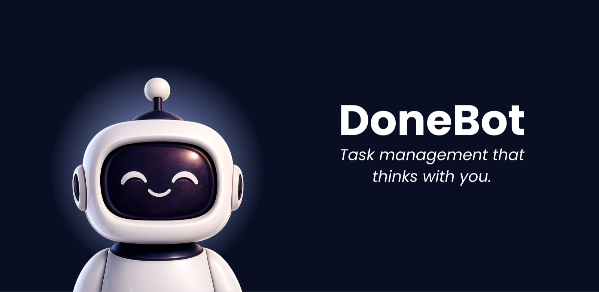

DoneBot is a to-do app that keeps thinking after you stop typing. Plan one-time, recurring and multi-step tasks, share lists with family, friends or teammates, keep a biometric-locked journal with a built-in polaroid camera, run pomodoro focus sessions, and watch your consistency grow on a GitHub-style activity heatmap. An AI assistant — DoneBot itself — manages your tasks in plain English or Turkish, and the whole app works offline and without an account.

> [!TIP]
> **DoneBot is live on Google Play** — [download it here](https://play.google.com/store/apps/details?id=com.todoapp.mobile). Free, no ads, no advertising ID. Current release: **v1.1.1**. An iOS version is coming soon to the App Store.

## Contents

- [Screenshots](#screenshots)
- [Features](#features)
- [System architecture](#system-architecture)
- [Client architecture](#client-architecture)
- [Design system](#design-system)
- [Offline-first data & sync](#offline-first-data--sync)
- [The DoneBot AI pipeline](#the-donebot-ai-pipeline)
- [Performance](#performance)
- [Security & privacy](#security--privacy)
- [Testing & CI](#testing--ci)
- [Building from source](#building-from-source)
- [Localization](#localization)
- [Project status](#project-status)
- [License & legal](#license--legal)

## Screenshots

<table>
  <tr>
    <td align="center">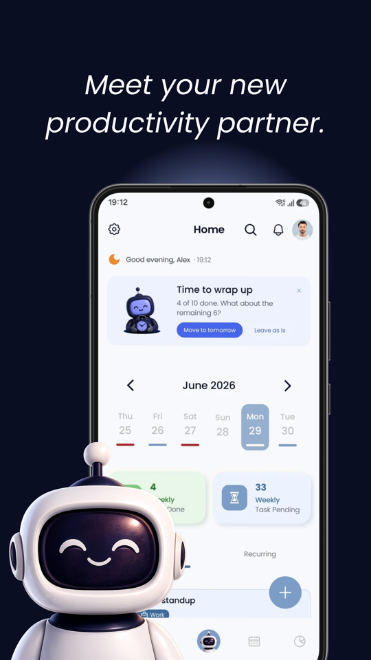<br /><sub><b>Home · Light</b></sub></td>
    <td align="center">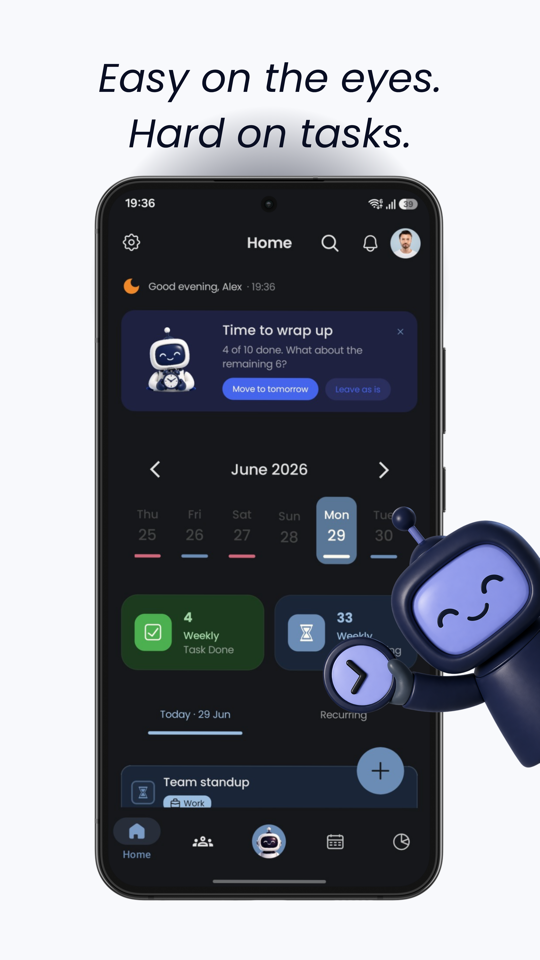<br /><sub><b>Home · Dark</b></sub></td>
    <td align="center">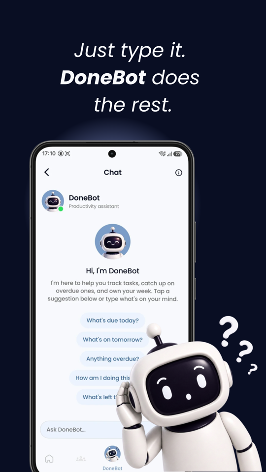<br /><sub><b>DoneBot AI chat</b></sub></td>
    <td align="center">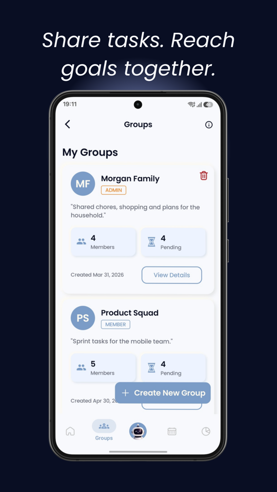<br /><sub><b>Groups</b></sub></td>
  </tr>
  <tr>
    <td align="center">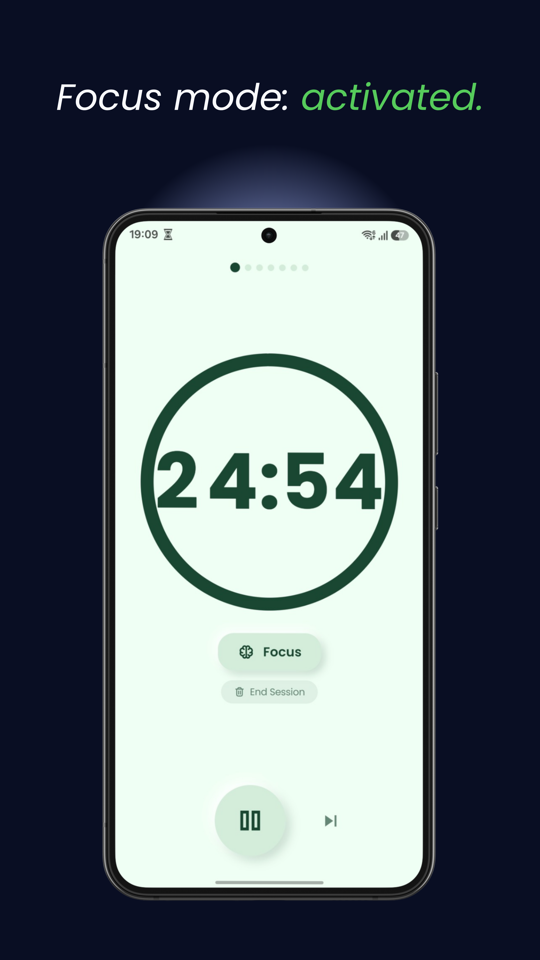<br /><sub><b>Pomodoro</b></sub></td>
    <td align="center">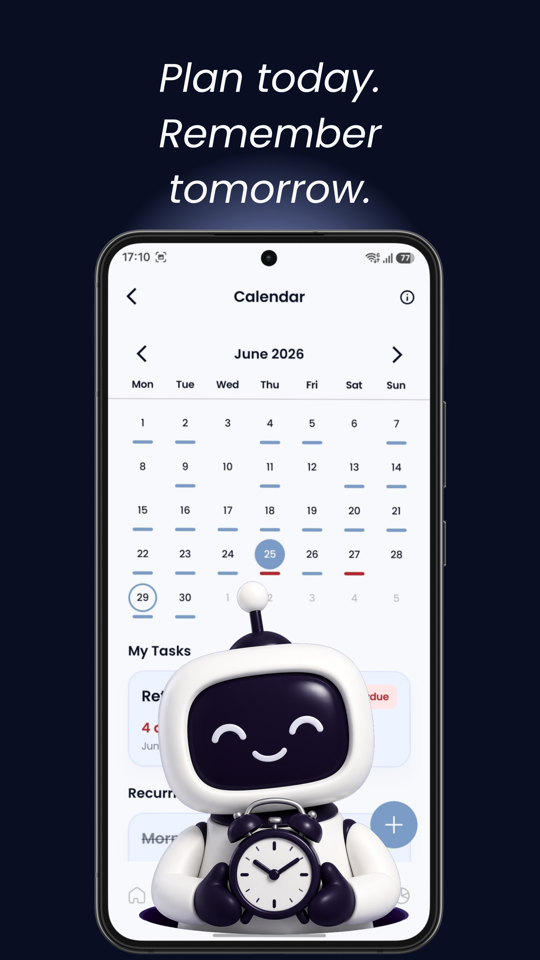<br /><sub><b>Calendar</b></sub></td>
    <td align="center">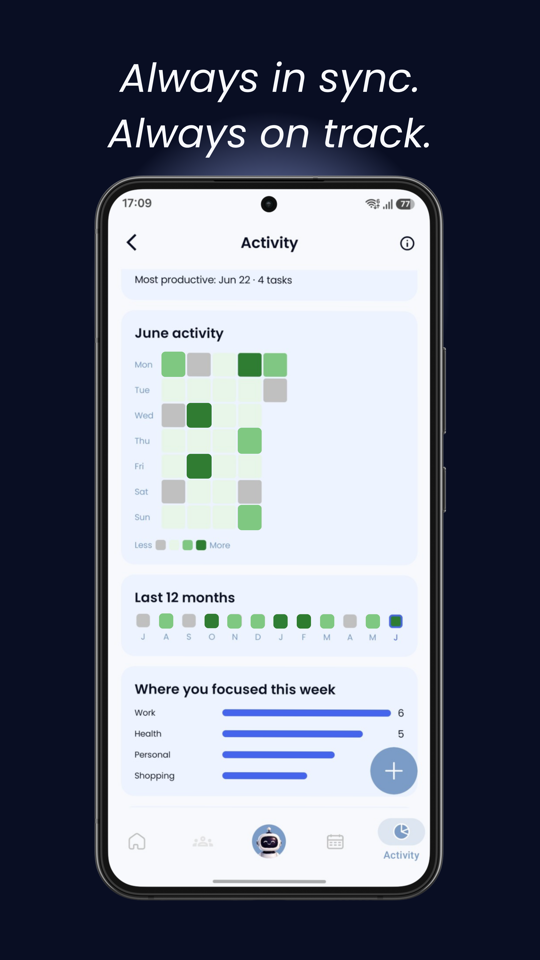<br /><sub><b>Activity heatmap</b></sub></td>
    <td align="center">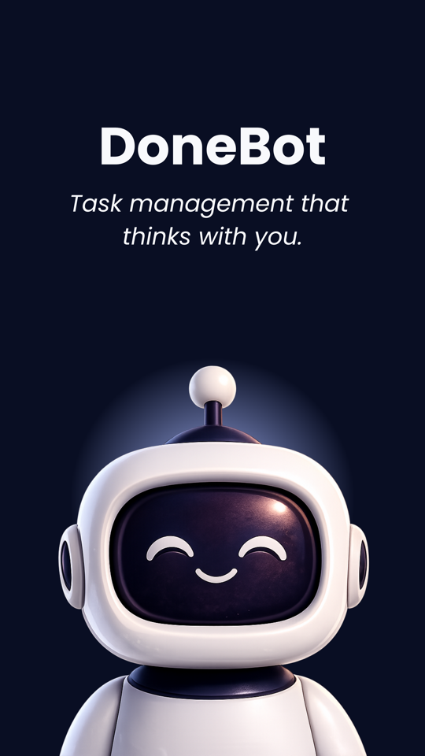<br /><sub><b>Onboarding</b></sub></td>
  </tr>
</table>

## Features

### Tasks & planning

- One-time, routine, staged (multi-step) and group tasks — all created from a single swipeable **Creation Hub**.
- Recurrence engine: daily / weekly / monthly / yearly, with month-end clamping (a "Jan 31" routine lands on Feb 28) and **per-day completion tracking**, so finishing today's instance never marks the whole routine done.
- Subtasks as ordered steps, with progress surfaced right on the task card.
- **Exact-alarm reminders** that survive reboots and app updates, a full-screen alarm experience, and a pickable alarm sound.
- Attach photos, categories and places to tasks — place search runs on Google Places and opens in Maps with one tap, **without the app ever requesting location permission**.
- Plan-your-day nudge at a time you choose, search with filters, drag-to-reorder, all-day tasks and custom categories.

### DoneBot, the AI assistant

- Manage tasks in plain **English or Turkish**: create, complete, reschedule, look things up, ask "how is my week going?".
- Two-tier pipeline: trivial intents ("what's due today?", pomodoro control) are answered **on-device with zero network calls**; everything else runs through a server-side Vertex AI function-calling loop.
- Bulk operations (complete / delete / reschedule many tasks) always list what will be touched and require an explicit "yes".
- Starts and stops **pomodoro sessions from chat** — the timer engine lives on the device, so it works offline.
- Suggestion chips, retry, stop-generation and rate-limit countdowns built into the chat UI; guests still get the on-device answers.

### Groups

- Shared task lists for family, friends or teammates: assignees, priorities, due dates, photos and locations on every task.
- Owner / admin / member roles, ownership transfer, and email invitations with an in-app invitation inbox.
- Group activity feed plus an in-app notification center; push notifications know when you are already looking at the screen and stay silent.
- Report inappropriate content and block members — the blocklist stays on your device.

### Journal

- Optional **biometric lock** on the whole journal.
- A skeuomorphic **polaroid camera** built on CameraX: snap a photo, watch the print develop, tape it into your entry.
- Moods, search and a date-grouped timeline.
- **100% device-local**: journal entries and photos never leave the phone and are excluded from OS backups by design.

### Pomodoro

- Custom timers, session queues and end-of-session summaries.
- Foreground-service notification with pause/skip controls, and a floating in-app banner that keeps the countdown visible anywhere in the app.

### Calendar & activity

- Month calendar with task markers and an indicator for overdue tasks hiding in earlier months.
- **GitHub-style contribution heatmap**, streak counter and yearly progress stats.

### Personalization & platform

- Light / dark / system theme, in-app **EN ⇄ TR language switch**, honors the device's 12/24-hour clock, reduce-motion toggle.
- Adaptive layouts: navigation rail and two-pane Groups on tablets and foldables, width-capped forms on large screens.
- **Secret mode**: hide selected tasks behind biometrics, with auto-re-hide timers from "immediately" up to 15 minutes.

### Private by default

- The full task experience **works without an account** — guest data lives only on the device.
- No ads, no advertising ID, no location permission.
- Crash & analytics telemetry is consent-gated with an in-app opt-out; performance telemetry is **opt-in** and off by default.
- Export all your data as JSON or delete your account at any time.

## System architecture

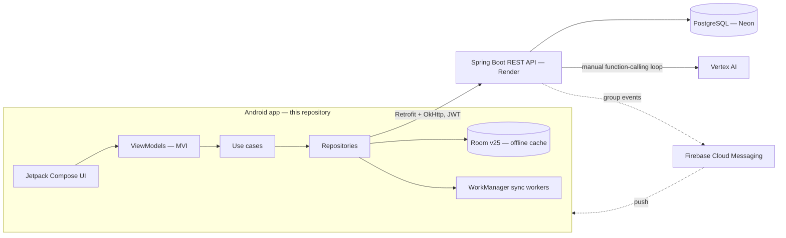

The client is **offline-first**: every read is served from Room, and writes are queued locally and reconciled with the backend by WorkManager when connectivity allows. Push messages about group activity trigger targeted cache refreshes instead of blind polling.

> [!NOTE]
> The backend (Spring Boot, PostgreSQL, Vertex AI orchestration) is a separate, private codebase. This repository contains the complete Android client.

## Client architecture

The app follows **Clean Architecture** with a strict inward dependency rule, and every screen speaks **MVI**:

- **Domain** — pure Kotlin: models, repository interfaces, `*UseCase` classes with `suspend operator fun invoke()`. No Android imports.
- **Data** — Room database + DAOs, Retrofit APIs, repository implementations, WorkManager workers, alarm scheduling, notification plumbing, FCM.
- **Presentation** — ~35 MVI feature packages. Each screen is exactly three core files: `*Contract.kt` (immutable `UiState`, user-driven `UiAction`, one-shot `UiEffect`), `*ViewModel.kt` (Hilt, `StateFlow` + effect `Channel`), `*Screen.kt` (Compose, renders every state branch).

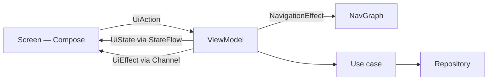

Navigation is type-safe Compose Navigation with `@Serializable` routes; ViewModels emit `NavigationEffect`s that the nav graph collects, so composables never touch the `NavController`. Dependency injection is Hilt across seven modules, including qualified coroutine dispatchers (`@IoDispatcher`, …) so nothing references `Dispatchers.*` directly.

### Modules

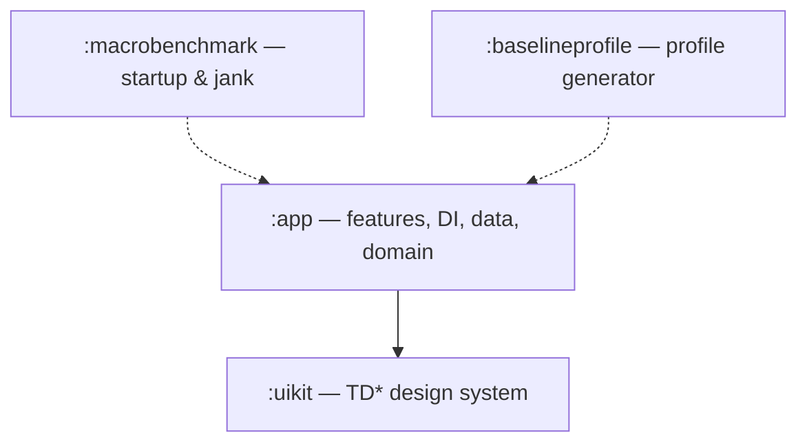

| Module | What lives there |
| --- | --- |
| `:app` | All features, navigation, DI, data and domain layers |
| `:uikit` | Reusable `TD*` Compose components + the theme — takes only primitives and lambdas, never `:app` types |
| `:baselineprofile` | Generates the baseline profile that ships with release builds |
| `:macrobenchmark` | Startup & scroll-jank benchmarks against the minified release variant |

## Design system

- **~60 shared `TD*` components** in `:uikit` — cards, sheets, skeleton loaders, empty/error states, confetti, the polaroid frame set and more.
- All styling flows through **`TDTheme` tokens** (semantic colors, Poppins typography, a dedicated polaroid palette) — no hardcoded colors or text styles in feature code.
- Dark mode is app-driven and every token resolves for both themes.
- A custom preview annotation suite (`@TDPreview`, `@TDPreviewDevices`, …) renders **light + dark in a single preview** and a 344/360/411 dp device-width matrix; every screen state and component variant ships with previews.

## Offline-first data & sync

- **Room, schema v25, 11 tables** — tasks, subtasks, pomodoro, groups, group tasks/members/activities, pending photos, per-day completions, chat history, journal.
- Every synced row carries a `syncStatus` (`PENDING_CREATE` / `PENDING_UPDATE` / `PENDING_DELETE` → `SYNCED`); reconciliation is idempotent via client-generated task IDs.
- Three workers behind on-demand WorkManager initialization: push local changes, fetch remote state, and re-schedule alarms after reboots or updates.
- A connectivity monitor gates network work; photo attachments captured offline wait in a `pending_photos` queue and upload later.
- Guest mode is the same pipeline with sync off — data simply stays local. Room schemas are exported and covered by an instrumented migration test.

## The DoneBot AI pipeline

1. A message first hits the **on-device intent classifier** (regex-anchored, English + Turkish). Greetings, "what's due today / tomorrow", overdue and weekly-progress queries, and pomodoro start/stop/status are answered instantly — offline, zero tokens.
2. Everything else goes to the backend as an authenticated `POST /chat/message` with the **last 10 turns** of context (the backend itself is stateless; history persists only in on-device Room).
3. The backend runs a **manual Vertex AI function-calling loop** over server-side task tools and returns the final reply.

Guardrails, by design:

- Bulk writes list affected tasks and require explicit confirmation before any tool call.
- Chat can **read** group tasks but is blocked from writing them — shared data doesn't change via one member's chatbot.
- Internal task IDs never appear in replies; the bot confirms by title and date, like the rest of the app.
- Rate limits surface as a friendly cooldown countdown, not an error wall.

## Performance

- **Checked-in baseline profile**, regenerated on-device and merged into release builds — hot startup paths ship pre-compiled.
- **Macrobenchmarks** for cold startup (with vs. without the profile, enforced via `CompilationMode.Partial(Require)`) and home-list scroll jank, run against the R8-minified release variant.
- **R8 + resource shrinking**, release log-call stripping, `en`+`tr` resource filtering and AAB splits keep the bundle lean.
- **CI enforces a 20 MiB AAB budget** on every push — the release bundle currently sits around 16.8 MiB.
- LeakCanary on debug builds; `onTrimMemory` hooks clear image caches under pressure; Coil runs on a tuned, auth-aware OkHttp client.

## Security & privacy

What users get:

- Journal entries and photos **never leave the device** and are excluded from OS backups and device-to-device transfer.
- **No ads, no advertising ID** (the AD_ID permission is actively removed), **no location permission**.
- Telemetry is consent-gated: crash & analytics reporting has an in-app opt-out, performance tracing is opt-in, and **all collection is disabled in debug builds**.
- GDPR-style **data export** (JSON) and **account deletion** in Settings.

How it's built:

- JWTs are encrypted with a **hardware-backed AndroidKeyStore AES-256-GCM** key before touching DataStore; key loss degrades to a clean logout, never a crash loop.
- `FLAG_SECURE` blocks screenshots/recording on auth, journal and secret-mode screens; destructive confirm buttons ignore taps while the window is obscured (tapjacking guard).
- **Firebase App Check (Play Integrity)** on API traffic; cleartext traffic is disabled app-wide via network security config.
- The only WebView (legal pages) runs with JavaScript, DOM storage and file access all disabled.
- Encrypted SharedPreferences for sensitive flags; biometric gates for the journal and secret mode.

## Testing & CI

Unit tests cover ViewModels, repositories, workers, the recurrence engine and crash-log redaction (JUnit4 + MockK + Turbine + Robolectric + WorkManager test harness); instrumented tests cover **Room migrations against exported schemas** and account-switch data isolation. ktlint and detekt run locally and in CI.

| CI job (GitHub Actions) | What it does |
| --- | --- |
| `lint-test` | ktlint + detekt (type-resolution) + unit tests + debug build on JDK 21 — zero secrets, fork-safe |
| `size-budget` | Builds an unsigned release AAB and **fails if it exceeds 20 MiB** |

## Building from source

> [!WARNING]
> Build with **JDK 21** (Android Studio's bundled JetBrains Runtime is exactly that). JDK 24 crashes Gradle with a cryptic `Type T not present` error. Bytecode still targets Java 17.

```bash
git clone https://github.com/beratbaran40/DoneBot.git
cd DoneBot
./gradlew assembleDebug
```

That's it — a fresh clone **builds and runs out of the box**: debug builds point at the hosted backend by default, `google-services.json` is committed deliberately (documented in the CI workflow; the keys it holds are client identifiers, not secrets), and a missing Maps key just disables place autocomplete with a log warning.

Optional `local.properties` keys:

| Key | Purpose |
| --- | --- |
| `debugBaseUrl` | Point debug builds at a different backend (e.g. `http://10.0.2.2:8080/`) |
| `MAPS_API_KEY` | Enables the Google Places / Maps location picker |

Useful commands:

```bash
./gradlew installDebug              # install on a connected device
./gradlew testDebugUnitTest         # unit tests (use this — not `test`)
./gradlew ktlintCheck detektMain    # formatting + static analysis
./gradlew :app:bundleRelease        # unsigned release AAB (CI parity)

# physical device required:
./gradlew :macrobenchmark:connectedBenchmarkReleaseAndroidTest
./gradlew :app:generateBaselineProfile
```

Notes:

- Debug installs side-by-side with the release app as `com.todoapp.mobile.debug`.
- Google Sign-In and FCM are bound to the Firebase project and signing certificates, so they won't work on third-party builds — email/password auth and everything else will.
- Release signing reads a git-ignored `keystore.properties` and is skipped when absent, so release builds stay unsigned outside the release pipeline.

## Localization

English and Turkish are first-class: **1,032 app strings + 74 design-system strings per language, at full parity**, enforced as a review rule — no user-visible string ever lands hardcoded. Language switches in-app (per-app locales), and time rendering follows the device's 12/24-hour setting. The Play listing ships localized screenshots for both languages (you're looking at them in this README).

## Project status

**Shipped.** DoneBot went to production on Google Play in July 2026 after a 12-tester closed beta, and is under active development — `v1.1.1` is the current public release. An iOS release is in the works. Found something broken, or want a feature? Open an issue or write to **donebotapp@gmail.com**.

## License & legal

Copyright © 2026 Berat Baran. **All rights reserved.**

The code is public so the engineering can be read and evaluated — it is **not open source**. Viewing and referencing are welcome; copying, modifying, redistributing or republishing it (in whole or in part, including on any app store) requires prior written permission. See [LICENSE](LICENSE). Code contributions aren't accepted right now; issues and feedback are.

[Privacy Policy](https://donebot-backend.onrender.com/legal/privacy.html) · [Terms of Service](https://donebot-backend.onrender.com/legal/terms.html) · donebotapp@gmail.com

---

<div align="center">
<sub>Built by <a href="https://github.com/beratbaran40">Berat Baran</a> · <a href="#donebot">back to top ↑</a></sub>
</div>
