<div align="center">

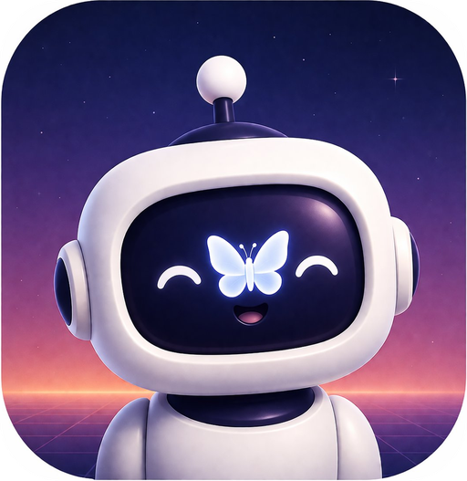

# DoneBot

**Seninle birlikte düşünen görev yöneticisi.**

Yerleşik yapay zekâ asistanlı, offline-first bir Android görev & üretkenlik uygulaması —
Jetpack Compose, Clean Architecture ve MVI ile geliştirildi.

[English](README.md) · **Türkçe**

[](https://github.com/beratbaran40/DoneBot/actions/workflows/ci.yml)


[](https://play.google.com/store/apps/details?id=com.todoapp.mobile)


</div>


DoneBot, sen yazmayı bıraktıktan sonra da düşünmeye devam eden bir görev uygulaması. Tek seferlik, rutin ve çok adımlı görevler planla; listelerini ailen, arkadaşların ya da takım arkadaşlarınla paylaş; içine polaroid kamera gömülü, biyometrik kilitli bir günlük tut; pomodoro odak seansları çalıştır; istikrarını GitHub tarzı bir aktivite ısı haritasında izle. Yapay zekâ asistanı — yani DoneBot'un kendisi — görevlerini Türkçe ya da İngilizce düz cümlelerle yönetiyor; uygulamanın tamamı internetsiz ve hesapsız da çalışıyor.

> [!TIP]
> **DoneBot Google Play'de yayında** — [buradan indir](https://play.google.com/store/apps/details?id=com.todoapp.mobile). Ücretsiz, reklamsız, reklam kimliği yok. Güncel sürüm: **v1.1.1**.

## İçindekiler

- [Ekran görüntüleri](#ekran-görüntüleri)
- [Özellikler](#özellikler)
- [Sistem mimarisi](#sistem-mimarisi)
- [Uygulama mimarisi](#uygulama-mimarisi)
- [Tasarım sistemi](#tasarım-sistemi)
- [Offline-first veri & senkronizasyon](#offline-first-veri--senkronizasyon)
- [DoneBot AI hattı](#donebot-ai-hattı)
- [Performans](#performans)
- [Güvenlik & gizlilik](#güvenlik--gizlilik)
- [Test & CI](#test--ci)
- [Kaynaktan derleme](#kaynaktan-derleme)
- [Yerelleştirme](#yerelleştirme)
- [Proje durumu](#proje-durumu)
- [Lisans & yasal](#lisans--yasal)

## Ekran görüntüleri

<table>
  <tr>
    <td align="center">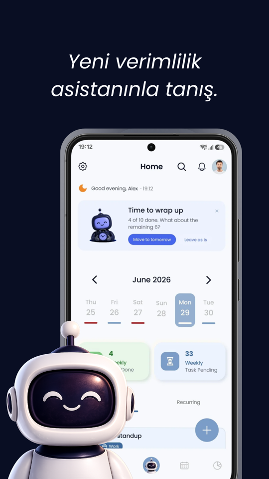<br /><sub><b>Ana ekran · Açık</b></sub></td>
    <td align="center">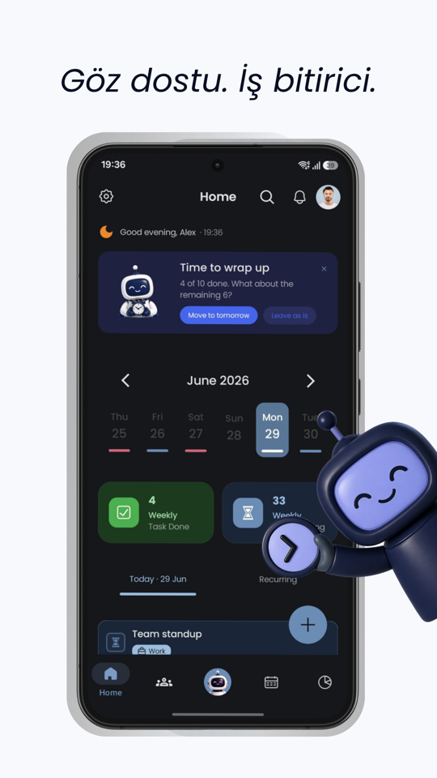<br /><sub><b>Ana ekran · Koyu</b></sub></td>
    <td align="center">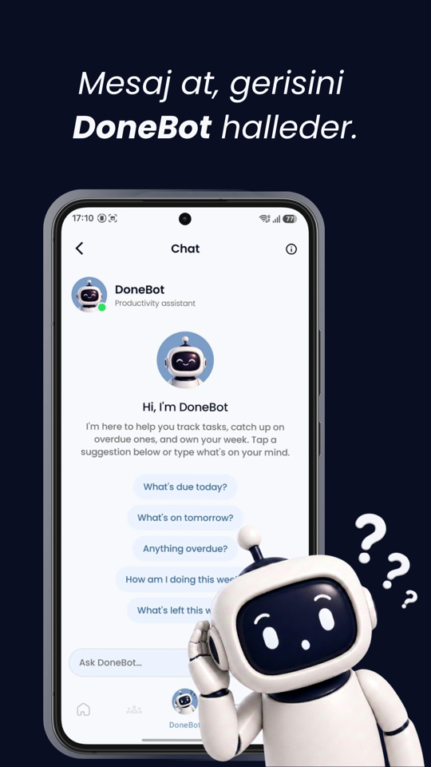<br /><sub><b>DoneBot AI sohbet</b></sub></td>
    <td align="center">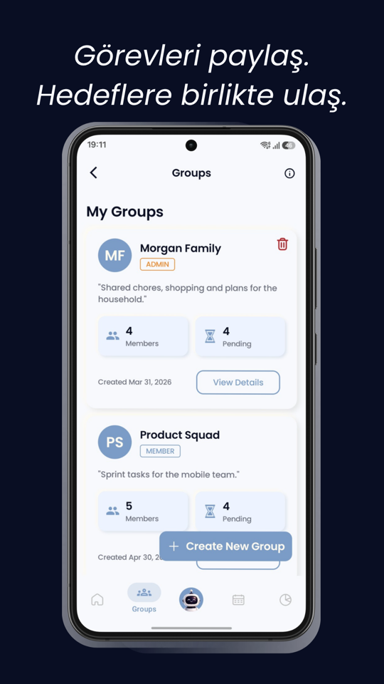<br /><sub><b>Gruplar</b></sub></td>
  </tr>
  <tr>
    <td align="center">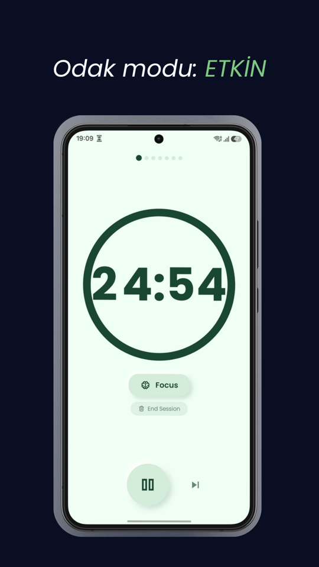<br /><sub><b>Pomodoro</b></sub></td>
    <td align="center">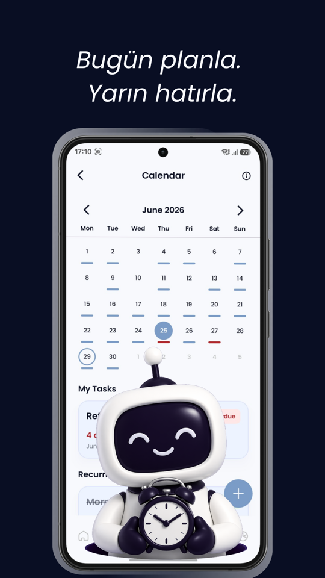<br /><sub><b>Takvim</b></sub></td>
    <td align="center">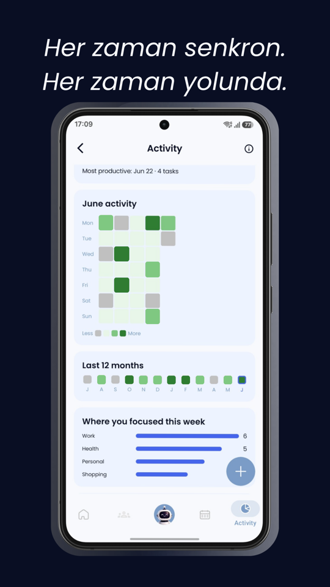<br /><sub><b>Aktivite haritası</b></sub></td>
    <td align="center"><br /><sub><b>Karşılama</b></sub></td>
  </tr>
</table>

## Özellikler

### Görevler & planlama

- Tek seferlik, rutin, aşamalı (çok adımlı) ve grup görevleri — hepsi kaydırmalı tek bir **Oluşturma Merkezi**'nden.
- Tekrar motoru: günlük / haftalık / aylık / yıllık; ay sonu düzeltmesiyle ("31 Ocak" rutini 28 Şubat'a oturur) ve **güne özel tamamlama takibiyle** — bugünkü tekrarı bitirmek rutinin tamamını "bitti" yapmaz.
- Sıralı adımlar hâlinde alt görevler; ilerleme doğrudan görev kartında.
- Yeniden başlatma ve uygulama güncellemelerinden sağ çıkan **hassas alarm hatırlatıcıları**, tam ekran alarm deneyimi, seçilebilir alarm sesi.
- Görevlere fotoğraf, kategori ve konum ekle — mekân araması Google Places üzerinde çalışır, tek dokunuşla Haritalar'da açılır ve **uygulama hiçbir zaman konum izni istemez**.
- Seçtiğin saatte "gününü planla" hatırlatması, filtreli arama, sürükle-bırak sıralama, tüm gün görevleri ve özel kategoriler.

### Yapay zekâ asistanı DoneBot

- Görevlerini düz **Türkçe ya da İngilizce** cümlelerle yönet: oluştur, tamamla, ertele, ara, "bu haftam nasıl gidiyor?" diye sor.
- İki katmanlı hat: basit niyetler ("bugün ne var?", pomodoro kontrolü) **cihaz üzerinde, hiç ağa çıkmadan** yanıtlanır; gerisi sunucu tarafında Vertex AI function-calling döngüsünden geçer.
- Toplu işlemler (çok sayıda görevi tamamlama / silme / erteleme) her zaman etkilenecek görevleri listeler ve açık bir "evet" ister.
- **Pomodoro'yu sohbetten başlatıp durdurur** — sayaç motoru cihazda yaşadığı için çevrimdışı da çalışır.
- Öneri çipleri, yeniden deneme, üretimi durdurma ve hız limiti geri sayımı sohbetin içinde hazır; misafir kullanıcılar da cihaz-içi yanıtları alır.

### Gruplar

- Aile, arkadaş ya da takım arkadaşlarıyla ortak görev listeleri: her görevde atanan kişi, öncelik, son tarih, fotoğraf ve konum.
- Sahip / yönetici / üye rolleri, sahiplik devri ve uygulama içi davet kutusuyla e-posta davetleri.
- Grup aktivite akışı + uygulama içi bildirim merkezi; push bildirimleri o ekrana zaten bakıyorsan sessiz kalmayı bilir.
- Uygunsuz içeriği raporla, üyeleri engelle — engel listesi cihazında kalır.

### Günlük

- Günlüğün tamamına isteğe bağlı **biyometrik kilit**.
- CameraX üzerine kurulmuş **polaroid kamera**: fotoğrafı çek, baskının belirmesini izle, bantla günlüğüne yapıştır.
- Ruh hâlleri, arama ve tarihe göre gruplanmış zaman akışı.
- **%100 cihaza özel**: günlük yazıları ve fotoğrafları telefondan asla çıkmaz, işletim sistemi yedeklerinin de bilinçli olarak dışında tutulur.

### Pomodoro

- Özel sayaçlar, seans kuyrukları ve seans sonu özetleri.
- Duraklat/atla kontrollü ön plan servisi bildirimi; uygulamanın neresinde olursan ol geri sayımı gösteren yüzen mini banner.

### Takvim & aktivite

- Görev işaretli ay takvimi ve önceki aylarda saklanan gecikmiş görevler için gösterge.
- **GitHub tarzı katkı ısı haritası**, seri (streak) sayacı ve yıllık ilerleme istatistikleri.

### Kişiselleştirme & platform

- Açık / koyu / sistem teması, uygulama içi **TR ⇄ EN dil değiştirme**, cihazın 12/24 saat ayarına uyum, animasyon azaltma seçeneği.
- Uyarlanabilir arayüz: tablet ve katlanabilirlerde navigasyon rayı ile çift panelli Gruplar, geniş ekranlarda genişliği sınırlanan formlar.
- **Gizli mod**: seçtiğin görevleri biyometrik kilit arkasına al; "hemen"den 15 dakikaya kadar otomatik yeniden gizleme sayaçları.

### Varsayılan olarak gizli

- Görev deneyiminin tamamı **hesapsız çalışır** — misafir verisi yalnızca cihazda yaşar.
- Reklam yok, reklam kimliği yok, konum izni yok.
- Çökme & analitik telemetrisi onaya bağlıdır ve uygulama içinden kapatılabilir; performans telemetrisi **varsayılan olarak kapalıdır**, açmak sana kalmış.
- Verilerini istediğin an JSON olarak dışa aktar ya da hesabını tamamen sil.

## Sistem mimarisi

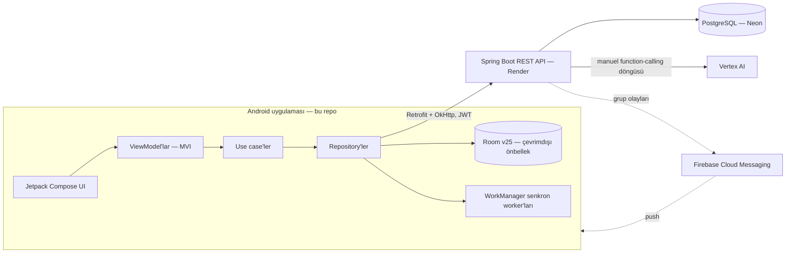

İstemci **offline-first** çalışır: her okuma Room'dan gelir, yazmalar önce yerelde kuyruğa alınır ve bağlantı elverdiğinde WorkManager backend ile uzlaştırır. Grup aktivitesiyle ilgili push mesajları kör bir yenileme yerine hedefli önbellek tazelemeleri tetikler.

> [!NOTE]
> Backend (Spring Boot, PostgreSQL, Vertex AI orkestrasyonu) ayrı ve özel bir kod tabanıdır. Bu repo, Android istemcisinin tamamını içerir.

## Uygulama mimarisi

Uygulama, katı bir içe-doğru bağımlılık kuralıyla **Clean Architecture** izler; her ekran **MVI** konuşur:

- **Domain** — saf Kotlin: modeller, repository arayüzleri, `suspend operator fun invoke()` imzalı `*UseCase` sınıfları. Android importu yok.
- **Data** — Room veritabanı + DAO'lar, Retrofit API'leri, repository implementasyonları, WorkManager worker'ları, alarm zamanlaması, bildirim altyapısı, FCM.
- **Presentation** — ~35 MVI feature paketi. Her ekran tam olarak üç çekirdek dosyadır: `*Contract.kt` (değişmez `UiState`, kullanıcı kaynaklı `UiAction`, tek atımlık `UiEffect`), `*ViewModel.kt` (Hilt, `StateFlow` + effect `Channel`), `*Screen.kt` (Compose, her state dalını çizer).

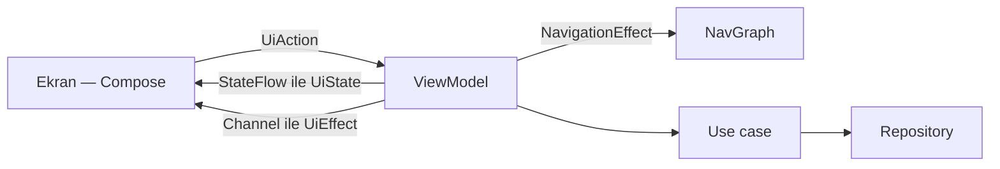

Navigasyon, `@Serializable` rotalarla tip-güvenli Compose Navigation; ViewModel'lar `NavigationEffect` yayınlar ve bunları nav graph toplar — composable'lar `NavController`'a hiç dokunmaz. Bağımlılık enjeksiyonu yedi modüllü Hilt; coroutine dispatcher'ları qualifier'lı (`@IoDispatcher`, …) verildiği için hiçbir yer doğrudan `Dispatchers.*` referans etmez.

### Modüller

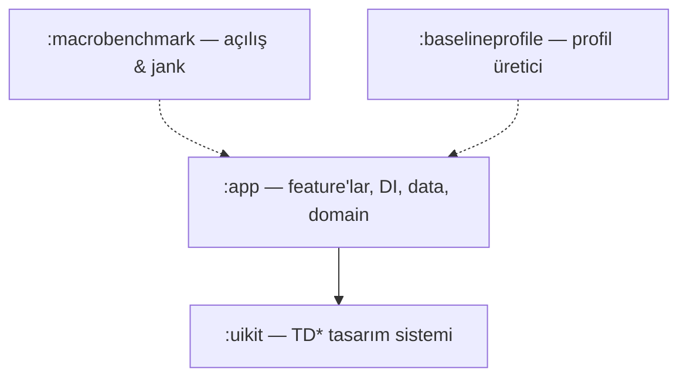

| Modül | İçinde ne var |
| --- | --- |
| `:app` | Tüm feature'lar, navigasyon, DI, data ve domain katmanları |
| `:uikit` | Yeniden kullanılabilir `TD*` Compose bileşenleri + tema — yalnızca primitif ve lambda alır, asla `:app` tipi almaz |
| `:baselineprofile` | Release derlemelerle gelen baseline profile'ı üretir |
| `:macrobenchmark` | Küçültülmüş release varyantına karşı açılış & kaydırma jank ölçümleri |

## Tasarım sistemi

- `:uikit` içinde **~60 paylaşılan `TD*` bileşeni** — kartlar, sheet'ler, skeleton yükleyiciler, boş/hata durumları, konfeti, polaroid çerçeve seti ve dahası.
- Tüm stiller **`TDTheme` token'larından** akar (semantik renkler, Poppins tipografisi, özel polaroid paleti) — feature kodunda sabit yazılmış renk ya da metin stili yok.
- Koyu mod uygulama kontrolündedir; her token iki tema için de çözümlenir.
- Özel preview anotasyon seti (`@TDPreview`, `@TDPreviewDevices`, …) **açık + koyu temayı tek preview'da** ve 344/360/411 dp cihaz genişliği matrisinde çizer; her ekran durumu ve bileşen varyantı preview'larıyla birlikte gelir.

## Offline-first veri & senkronizasyon

- **Room, şema v25, 11 tablo** — görevler, alt görevler, pomodoro, gruplar, grup görevleri/üyeleri/aktiviteleri, bekleyen fotoğraflar, güne özel tamamlamalar, sohbet geçmişi, günlük.
- Senkronize her satır bir `syncStatus` taşır (`PENDING_CREATE` / `PENDING_UPDATE` / `PENDING_DELETE` → `SYNCED`); uzlaştırma, istemcinin ürettiği görev kimlikleri sayesinde idempotenttir.
- İsteğe bağlı başlatılan WorkManager arkasında üç worker: yerel değişiklikleri it, uzak durumu çek, yeniden başlatma/güncelleme sonrası alarmları yeniden kur.
- Bağlantı monitörü ağ işlerini kapılar; çevrimdışı çekilen fotoğraf ekleri `pending_photos` kuyruğunda bekler, sonra yüklenir.
- Misafir modu aynı hattın senkronu kapalı hâlidir — veri yalnızca yerelde kalır. Room şemaları dışa aktarılır ve enstrümante bir migration testiyle korunur.

## DoneBot AI hattı

1. Mesaj önce **cihaz üzerindeki niyet sınıflandırıcısına** uğrar (regex çıpalı, Türkçe + İngilizce). Selamlaşma, "bugün/yarın ne var", gecikenler, haftalık ilerleme ve pomodoro başlat/durdur/durum anında yanıtlanır — çevrimdışı, sıfır token.
2. Gerisi, **son 10 konuşma turuyla** birlikte kimlik doğrulamalı `POST /chat/message` olarak backend'e gider (backend durumsuzdur; geçmiş yalnızca cihazdaki Room'da saklanır).
3. Backend, sunucu tarafı görev araçları üzerinde **manuel bir Vertex AI function-calling döngüsü** çalıştırır ve nihai yanıtı döner.

Tasarım gereği korkuluklar:

- Toplu yazmalar, herhangi bir araç çağrısından önce etkilenecek görevleri listeler ve açık onay ister.
- Sohbet grup görevlerini **okuyabilir** ama yazamaz — ortak veri, tek bir üyenin sohbet botu üzerinden değişmez.
- Yanıtlarda dahili görev kimlikleri asla görünmez; bot da uygulamanın geri kalanı gibi başlık + tarihle teyit eder.
- Hız limitleri hata duvarı değil, dostane bir geri sayım olarak görünür.

## Performans

- **Repoya dahil baseline profile**, cihazda yeniden üretilir ve release derlemelere gömülür — sıcak açılış yolları önceden derlenmiş gelir.
- Soğuk açılış (profilli / profilsiz, `CompilationMode.Partial(Require)` ile güvenceli) ve ana liste kaydırma jank'i için **macrobenchmark'lar**, R8 ile küçültülmüş release varyantına karşı koşar.
- **R8 + kaynak küçültme**, release'te log çağrısı ayıklama, `en`+`tr` kaynak filtresi ve AAB bölmeleri paketi hafif tutar.
- **CI her push'ta 20 MiB AAB bütçesi uygular** — release paketi şu an ~16,8 MiB civarında.
- Debug derlemelerde LeakCanary; bellek baskısında `onTrimMemory` görsel önbelleklerini boşaltır; Coil, ayarlı ve kimlik doğrulamalı OkHttp istemcisiyle çalışır.

## Güvenlik & gizlilik

Kullanıcının kazandıkları:

- Günlük yazıları ve fotoğrafları **cihazdan asla çıkmaz**; işletim sistemi yedeklemesinin ve cihazdan cihaza aktarımın dışında tutulur.
- **Reklam yok, reklam kimliği yok** (AD_ID izni bilinçli olarak kaldırılır), **konum izni yok**.
- Telemetri onaya bağlı: çökme & analitik raporlaması uygulama içinden kapatılabilir, performans izleme varsayılan kapalıdır ve **debug derlemelerde tüm toplama devre dışıdır**.
- Ayarlar'dan GDPR tarzı **veri dışa aktarma** (JSON) ve **hesap silme**.

Nasıl inşa edildiği:

- JWT'ler DataStore'a değmeden önce **donanım destekli AndroidKeyStore AES-256-GCM** anahtarıyla şifrelenir; anahtar kaybı çökme döngüsüne değil, temiz bir oturum kapatmaya düşer.
- `FLAG_SECURE`, kimlik doğrulama, günlük ve gizli mod ekranlarında ekran görüntüsünü/kaydını engeller; yıkıcı onay düğmeleri pencere perdelendiğinde dokunuşları yok sayar (tapjacking koruması).
- API trafiğinde **Firebase App Check (Play Integrity)**; network security config ile uygulama genelinde şifresiz (cleartext) trafik kapalı.
- Tek WebView (yasal sayfalar) JavaScript, DOM depolama ve dosya erişimi tamamen kapalı çalışır.
- Hassas bayraklar için şifreli SharedPreferences; günlük ve gizli mod için biyometrik kapılar.

## Test & CI

Birim testleri ViewModel'ları, repository'leri, worker'ları, tekrar motorunu ve çökme günlüğü anonimleştirmeyi kapsar (JUnit4 + MockK + Turbine + Robolectric + WorkManager test altyapısı); enstrümante testler **dışa aktarılmış şemalara karşı Room migration'larını** ve hesap değişiminde veri izolasyonunu doğrular. ktlint ve detekt hem yerelde hem CI'da koşar.

| CI işi (GitHub Actions) | Ne yapar |
| --- | --- |
| `lint-test` | JDK 21 üzerinde ktlint + detekt (tip çözümlemeli) + birim testleri + debug derleme — sıfır secret, fork-güvenli |
| `size-budget` | İmzasız release AAB üretir ve **20 MiB'ı aşarsa işi düşürür** |

## Kaynaktan derleme

> [!WARNING]
> **JDK 21** ile derleyin (Android Studio'nun kendi JetBrains Runtime'ı tam olarak budur). JDK 24, Gradle'ı şifreli bir `Type T not present` hatasıyla çökertir. Bytecode hedefi Java 17'de kalır.

```bash
git clone https://github.com/beratbaran40/DoneBot.git
cd DoneBot
./gradlew assembleDebug
```

Hepsi bu — taze bir klon **kutudan çıktığı gibi derlenir ve çalışır**: debug derlemeler varsayılan olarak barındırılan backend'e bağlanır, `google-services.json` bilinçli olarak repodadır (CI workflow'unda belgelendi; içindekiler istemci tanımlayıcılarıdır, secret değildir), Maps anahtarı yoksa mekân araması sadece bir log uyarısıyla devre dışı kalır.

İsteğe bağlı `local.properties` anahtarları:

| Anahtar | Ne işe yarar |
| --- | --- |
| `debugBaseUrl` | Debug derlemeleri başka bir backend'e yönlendirir (ör. `http://10.0.2.2:8080/`) |
| `MAPS_API_KEY` | Google Places / Haritalar konum seçicisini etkinleştirir |

İşe yarar komutlar:

```bash
./gradlew installDebug              # bağlı cihaza kur
./gradlew testDebugUnitTest         # birim testleri (bunu kullan — `test` değil)
./gradlew ktlintCheck detektMain    # biçim + statik analiz
./gradlew :app:bundleRelease        # imzasız release AAB (CI ile birebir)

# fiziksel cihaz gerektirir:
./gradlew :macrobenchmark:connectedBenchmarkReleaseAndroidTest
./gradlew :app:generateBaselineProfile
```

Notlar:

- Debug sürüm, release uygulamanın yanına `com.todoapp.mobile.debug` olarak kurulur.
- Google ile Giriş ve FCM, Firebase projesine ve imza sertifikalarına bağlıdır; üçüncü taraf derlemelerde çalışmazlar — e-posta/şifre girişi ve uygulamanın kalanı çalışır.
- Release imzalama git'e girmeyen `keystore.properties` dosyasını okur ve dosya yoksa atlanır; release derlemeler yayın hattının dışında imzasız kalır.

## Yerelleştirme

Türkçe ve İngilizce birinci sınıf vatandaş: **dil başına 1.032 uygulama + 74 tasarım sistemi metni, tam paritede** ve bu bir inceleme kuralı olarak uygulanıyor — kullanıcıya görünen hiçbir metin koda gömülü gitmez. Dil uygulama içinden değişir (per-app locales), saat gösterimi cihazın 12/24 saat ayarına uyar. Play mağaza sayfası iki dil için de yerelleştirilmiş görsellerle yayında (bu README'de gördükleriniz onlar).

## Proje durumu

**Yayında.** DoneBot, 12 kişilik kapalı betanın ardından Temmuz 2026'da Google Play'de üretime çıktı ve aktif olarak geliştirilmeye devam ediyor — güncel yayın sürümü `v1.1.1`. Bozuk bir şey mi buldun, bir özellik mi istiyorsun? Issue aç ya da **donebotapp@gmail.com** adresine yaz.

## Lisans & yasal

Telif hakkı © 2026 Berat Baran. **Tüm hakları saklıdır.**

Kod, mühendisliği okunup değerlendirilebilsin diye herkese açık — **açık kaynak değil**. İncelemek ve referans almak serbesttir; kopyalamak, değiştirmek, yeniden dağıtmak ya da (herhangi bir uygulama mağazası dahil) kısmen veya tamamen yeniden yayımlamak önceden yazılı izin gerektirir. Bkz. [LICENSE](LICENSE). Şu an kod katkısı kabul edilmiyor; issue ve geri bildirim her zaman açık.

[Gizlilik Politikası](https://donebot-backend.onrender.com/legal/privacy.html) · [Kullanım Şartları](https://donebot-backend.onrender.com/legal/terms.html) · donebotapp@gmail.com

---

<div align="center">
<sub><a href="https://github.com/beratbaran40">Berat Baran</a> tarafından geliştirildi · <a href="#donebot">başa dön ↑</a></sub>
</div>
